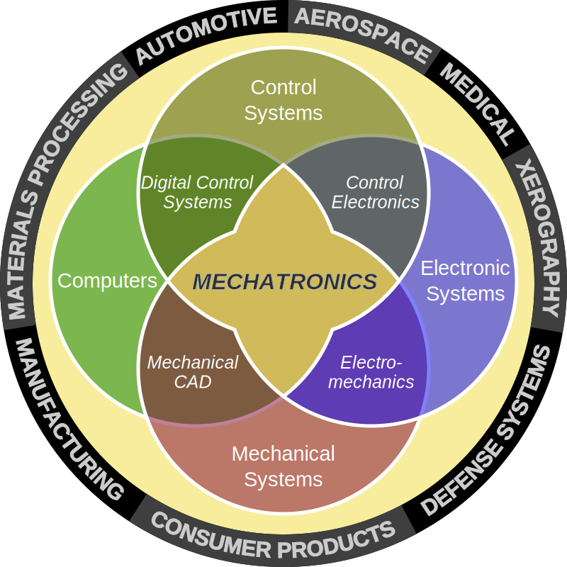

Awesome Mechatronics 
================

 

 

> Mechatronics, which is also called mechatronic engineering, is a multidisciplinary branch of engineering that focuses on the engineering of both electrical and mechanical systems, and also includes a combination of robotics, electronics, computer, telecommunications, systems, control, and product engineering. (Wikipedia)

 

The following list is a combination of various books, courses and other resources related to the mechatronic engineering. However, becuase Mechatronics is a board term that conatins many fields, the links below are fouced on the mechatronic point of view for the different topics. Additionally, resources for mechatronics applications are also listed.

It's an attempt to gather useful material in one place for everybody who wants to learn more about the mechatronic engineering.

## Courses ##

* [Learn 5 PLCs in a Day](https://www.udemy.com/course/nfi-plc-online-leaning/) **Udemy**

* [From wire to plc a bootcamp in industrial automation](https://www.udemy.com/course/from-wire-to-plc-a-to-z-compilation/) **Udemy**

* [Wearable Robotics-Exoskeletons (Lower Limb)](https://www.udemy.com/course/wearable-robots-robotic-exoskeleton-lower-limb/) **Udemy**

## Books ##

* [Mechatronics: Electronic Control Systems in Mechanical and Electrical Engineering (6th Edition)](https://www.amazon.com/Mechatronics-Electronic-Mechanical-Electrical-Engineering/dp/1292076682)

* [Learning FPGAs: Digital Design for Beginners with Mojo and Lucid HDL](https://www.amazon.com/Learning-FPGAs-Digital-Design-Beginners/dp/1491965495)

* [Machine Vision and Mechatronics in Practice](https://www.amazon.com/Machine-Vision-Mechatronics-Practice-Billingsley/dp/3662455137)

* [Introduction to Mechatronics and Measurement Systems 5th Edition](https://www.amazon.com/Introduction-Mechatronics-Measurement-Systems-Alciatore/dp/1259892344)

* [Elementary Mechanics Using Python: A Modern Course Combining Analytical and Numerical Techniques (Undergraduate Lecture Notes in Physics)](https://www.amazon.com/Elementary-Mechanics-Using-Python-Undergraduate/dp/3319195956)

* [Automotive Mechatronics: Automotive Networking, Driving Stability Systems, Electronics (Bosch Professional Automotive Information) ](https://www.amazon.com/Automotive-Mechatronics-Electronics-Professional-Information/dp/3658039744)

* [THE MECHATRONICS HANDBOOK - Robert Bishop](http://www.sze.hu/~szenasy/Szenzorok%20%E9s%20aktu%E1torok/Szenzakt%20jegyzetek/Mechatronics_handbook%5B1%5D.pdf) 

* [Mechatronic Systems: Modelling and Simulation with HDLs](https://www.amazon.com/Mechatronic-Systems-Modelling-Simulation-HDLs/dp/0470849797)

### Industrial Automation Books ###

* [Arduino Home Automation Projects : Automate your Home using the powerful Arduino Platform](https://www.amazon.com/Arduino-Home-Automation-Projects-Experience/dp/1783986069)

* [Programmable Logic Controllers: Programming Methods and Applications - John Hackworth](https://www.amazon.com/Programmable-Logic-Controllers-Programming-Applications/dp/0130607185)

* [Automation for Robotics - Luc Julian](https://www.wiley.com/en/Automation+for+Robotics-p-9781119081425)

* [Programmable Logic Controllers - Fifth edition - Frank D. Petruzella](https://www.amazon.com/Programmable-Logic-Controllers-Frank-Petruzella/dp/0073373842)

### Machine Vision ###

* [Computer Vision: Algorithms and Applications](http://szeliski.org/Book/drafts/SzeliskiBook_20100903_draft.pdf)

### Robotics ###
* [Probabilistic Robotics (Intelligent Robotics and Autonomous Agents series)](http://www.amazon.com/Probabilistic-Robotics-Intelligent-Autonomous-Agents/dp/0262201623/)  :dollar:

### Artificail Intelllegence ###

* [Deep Learning - Ian Goodfellow and Yoshua Bengio and Aaron Courville](http://www.deeplearningbook.org/)

## Programming Langauges ##

* [C/C++ langauges](https://en.cppreference.com/w/) Important Langauge for the mechatronic engineer

* [MATLAB](https://www.mathworks.com/products/matlab.html) A very starter friendly interface with many toolboxes covering almost all of the mechatronics topics but not free. :dollar:

* [Python](https://www.python.org) A rising langauge with shorter development time.

## Software and Libraries ##

[**SolidWorks**](https://www.solidworks.com) CAD software , with many featuers, like simulating the physics as well as the mechanical featuers of the machine parts. :dollar:

[**Factor I/O**](https://factoryio.com/) An automation simluation program where a real PLC can be programmed to control this simulated environment. :dollar:

[**Siemens Step 7**](https://support.industry.siemens.com/cs/document/109761679/step-7-v5-6-sp1-step-7-professional-2017-sr1-trial-download?dti=0&lc=en-WW) Siemens PLCs Official IDE for Programming. :dollar:

[**Fritzing**](https://fritzing.org/home/) A designing program for the different electronics parts like sensors and actuators as well as wiring.

[**Proteus**](https://www.labcenter.com) PCB Design and Circuit Simulator Software.

[**LabView**](https://www.ni.com/en-us/shop/labview.html) System-design platform and development environment for a visual programming language.

[**Arduino**](https://www.arduino.cc/) An Open-Source hardware devices, with many brands and types used in IoT

[**Raspery Pi**](https://www.raspberrypi.org/) A popular single-board computer which can process real time sensors feed like cameras.

[**TensorFlow**](https://www.tensorflow.org) TensorFlow is an end-to-end open source platform for machine learning.

[**OpenCV**](https://opencv.org) Library of programming functions mainly aimed at real-time computer vision.

[**ROS**](http://www.ros.org/)
The Robot Operating System (ROS) is a flexible framework for writing robot software. It is a collection of tools, libraries, and conventions that aim to simplify the task of creating complex and robust robot behavior across a wide variety of robotic platforms.

[**Gazebo**](http://gazebosim.org/)
Robot Simulator which integrate with ROS.

[**Blender**](https://www.blender.org) An open source 3D modelling program. it can be used as CAD program but it has a steep learning curve.
## Journals and Conferences ##

* [Mechatronics Elsevier Journal](http://www.journals.elsevier.com/mechatronics)

* [Mechanisms and Machine Science - Springer Series](https://www.springer.com/series/8779)

* [Advanced Mechatronics and MEMS Devices - Springer](https://www.springer.com/gp/book/9781441999849)

## Mechatronic Systems ##

* [**ABS**](https://en.wikipedia.org/wiki/Anti-lock_braking_system) Anti-lock Braking System.

* [**3D Printers**](https://en.wikipedia.org/wiki/3D_printing)

* [**GPS/GNSS**](https://en.wikipedia.org/wiki/Satellite_navigation) Global Navigation Satellite System.

* [**PLCs**](https://en.wikipedia.org/wiki/Programmable_logic_controller) Programmable logic controller.

* [**Hybrid Cars**](https://en.wikipedia.org/wiki/Hybrid_vehicle) uses two or more distinct types of power, such as internal combustion engine to drive an electric generator that powers an electric motor.

* [**Washing Machines**](https://en.wikipedia.org/wiki/Washing_machine)

* [**Robots**](https://en.wikipedia.org/wiki/Robot)

## Related awesome lists ##
* [Awesome Embedded and IoT Security](https://github.com/fkie-cad/awesome-embedded-and-iot-security)

* [Awesome C-plus-plus](https://github.com/fffaraz/awesome-cpp)

* [Awesome Artificial Intelligence](https://github.com/owainlewis/awesome-artificial-intelligence)
* [Awesome Computer Vision](https://github.com/jbhuang0604/awesome-computer-vision)
* [Awesome Machine Learning](https://github.com/josephmisiti/awesome-machine-learning)
* [Awesome Deep Learning](https://github.com/ChristosChristofidis/awesome-deep-learning)

* [Awesome Robotics](https://github.com/ahundt/awesome-robotics)

* [Awesome ROS2](https://github.com/fkromer/awesome-ros2)

* [Awesome Python](https://github.com/vinta/awesome-python)
